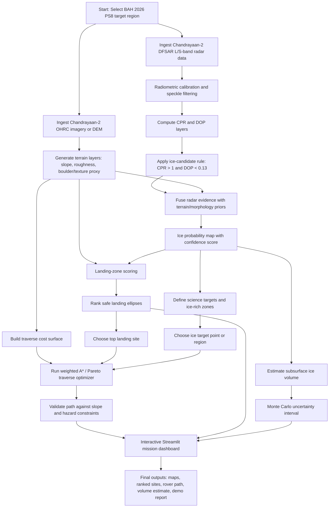
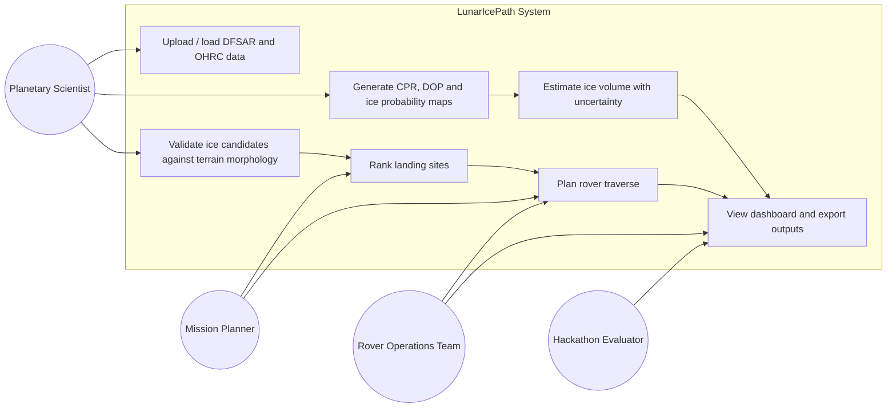
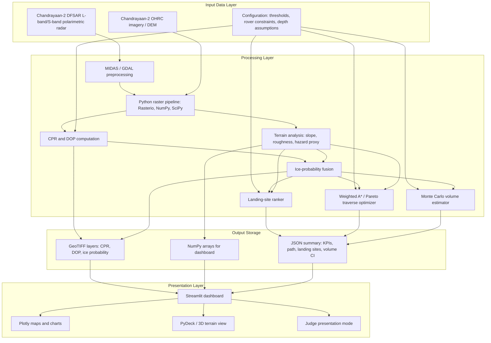

# BAH 2026 PS8 Submission Package - LunarIcePath

## Which Problem Statement

**Selected problem statement:** **Problem Statement 08 - Detection and Characterization of Subsurface Ice in Lunar South Polar Regions Using Chandrayaan-2 Radar and Imagery Data for Landing Site and Rover Traverse Planning.**

This is the correct problem statement for the current repository because the code, proposal, research brief, and dashboard are already built around Chandrayaan-2 DFSAR radar products, OHRC terrain analysis, lunar south-pole permanently shadowed regions, landing-site ranking, rover traversal, and ice-volume estimation.

**Hackathon:** Bharatiya Antariksh Hackathon 2026 by ISRO, powered by Hack2skill.  
**Team size rule:** 3-4 students.  
**Idea submission deadline on event page:** 1 July 2026.  
**Grand finale on event page:** 6-7 August 2026.  
**Project title:** LunarIcePath - Integrated Subsurface Ice Detection, Landing Site Selection, and Rover Traverse Planning.

References used:

- Hackathon event page: https://hack2skill.com/event/bah2026/
- Challenge 08 title listed on the event page: Detection and Characterization of Subsurface Ice in Lunar South Polar Regions Using Chandrayaan-2 Radar and Imagery Data for Landing Site and Rover Traverse Planning.
- Chandrayaan-2 DFSAR instrument background: https://arxiv.org/abs/2104.14259
- Supporting news context on recent PRL/ISRO lunar ice study: https://timesofindia.indiatimes.com/city/ahmedabad/prl-study-sheds-new-light-on-moons-icy-secrets/articleshow/131075527.cms

---

## Brief About Your Idea

LunarIcePath is an end-to-end lunar mission planning solution for identifying probable subsurface water ice in the Moon's south polar permanently shadowed regions and converting that science result into practical mission decisions. The idea is not limited to producing a single radar heatmap. It builds a complete planning pipeline that starts with Chandrayaan-2 radar and imagery data, detects likely ice-bearing zones, ranks nearby safe landing sites, plans a rover route toward the target, and estimates the likely recoverable ice volume with uncertainty bounds.

The solution is designed for BAH 2026 Problem Statement 08, which asks for detection and characterization of subsurface ice in lunar south polar regions using Chandrayaan-2 radar and imagery data for landing site and rover traverse planning. This problem is important because lunar water ice is one of the most valuable resources for future exploration. Water can support astronauts, provide oxygen, and potentially be split into hydrogen and oxygen for propellant. However, finding water ice is not enough. A mission team also needs to know whether the target is reachable, whether a lander can safely touch down nearby, whether a rover can survive the terrain, and how much scientific or resource value the site may contain.

The core concept of LunarIcePath is to combine three capabilities into one system. The first capability is **subsurface ice detection** using Chandrayaan-2 DFSAR polarimetric radar signatures. DFSAR operates at L-band and S-band and can provide information about scattering behavior from the lunar near-surface. The solution computes the Circular Polarization Ratio, or CPR, and Degree of Polarization, or DOP. High CPR can indicate volumetric scattering, which may be consistent with ice, but high CPR alone can also be produced by rough rocky terrain. Therefore, LunarIcePath combines CPR with low DOP and terrain morphology to reduce false positives. The proposed baseline criterion is CPR greater than 1 and DOP less than 0.13, then softened into an ice-probability score instead of a rigid binary label.

The second capability is **landing and mobility planning** using OHRC imagery or DEM-derived terrain products. Even if a crater has a strong ice signature, it may be useless for a rover mission if the surrounding terrain is too steep, too rough, or blocked by hazards. LunarIcePath computes slope and roughness layers, identifies candidate landing ellipses, and ranks each site based on safety and science access. It then creates a cost surface for rover motion where high slope, high roughness, and unsafe areas are penalized, while proximity to ice-rich targets is rewarded. A weighted A* path planner then generates a safe route from the best landing site to the selected ice target. The architecture also allows multiple weight settings to produce Pareto paths for safety-first, science-first, and balanced mission modes.

The third capability is **resource characterization**. Instead of only saying "ice is present," the system estimates the volume of possible ice-bearing material in the top regolith layer. It uses the high-probability ice mask, pixel area, assumed depth, and assumed ice fraction to estimate volume. A Monte Carlo simulation perturbs the depth, ice fraction, and boundary assumptions to produce a confidence interval. This makes the output more honest and useful because lunar ice estimation from orbital radar is uncertain. A planning team should see the range of possible values instead of one overconfident number.

The final deliverable is an interactive Streamlit dashboard that acts like a mission-control interface. It shows the ice probability overlay, CPR and DOP maps, ranked landing sites, rover path animation, elevation profile, volume estimate, and 3D terrain view. A "Present to Judges" mode guides the demo through four steps: Detect, Land, Traverse, and Volume. This makes the solution easy to demonstrate in the hackathon finale while still being technically connected to the underlying data pipeline.

The innovation is the integration. Many approaches stop at ice classification; LunarIcePath connects detection to action. It gives a judge or mission planner the answer to four questions in sequence: Where is the strongest evidence of ice? Where can we land safely? How can a rover reach the target? How much ice-bearing material might be present? This makes the proposal practical for ISRO-style lunar exploration planning and directly aligned with future south-pole missions, ISRU studies, and rover operations.

---

## What Problem We Are Trying To Solve

The Moon's south polar region is a major target for current and future space exploration because it contains permanently shadowed regions where temperatures remain extremely low. These regions can trap volatile materials, including water ice, over geological time. Water ice is scientifically valuable because it records the delivery and migration of volatiles in the inner Solar System. It is also operationally valuable because water can support future human and robotic missions. It can be used for drinking water, oxygen generation, radiation shielding, thermal control, and possibly propellant production after electrolysis. For a nation planning long-duration lunar exploration, identifying and characterizing water ice is not a small science task; it is a strategic mission planning requirement.

However, the practical problem is difficult. The most promising locations are often inside permanently shadowed craters near the lunar poles. These areas do not receive direct sunlight, so optical imaging is challenging, thermal conditions are extreme, and rover operations become energy constrained. The terrain can be steep, cratered, rough, and hazardous. A site that looks scientifically valuable from an orbital map may be unsafe for landing or inaccessible for a rover. Therefore, the real problem is not just ice detection. The real problem is converting uncertain orbital measurements into a trustworthy exploration plan.

Current or basic approaches usually treat the problem as a mapping exercise. A team may compute a CPR map from radar data and mark high-CPR pixels as potential ice. That is useful but incomplete. Circular Polarization Ratio greater than 1 can suggest multiple scattering or volumetric scattering, but it is not a unique signature of ice. Young rocky craters and rough blocky surfaces can also produce high CPR. If the system relies only on CPR, it may incorrectly mark rough terrain as ice-rich. A mission planner who trusts such a map without additional validation could choose a target that is scientifically weak or operationally unsafe.

The second issue is that ice evidence and landing safety are usually analyzed separately. A high-confidence ice region may lie inside a steep crater wall or near boulder-rich terrain. A safe landing zone may be too far from the target for a small rover. A rover path that is shortest in distance may cross slopes beyond its mobility limit. If these decisions are made manually, the process becomes slow, subjective, and hard to repeat under hackathon or mission-planning time constraints. LunarIcePath addresses this by integrating terrain analysis and path planning into the same pipeline as ice detection.

The third issue is uncertainty. Orbital radar observations are indirect. They provide evidence of scattering behavior, not a direct sample of ice. DOP, CPR, radar incidence angle, local roughness, regolith properties, and viewing geometry all affect interpretation. Even after applying a strong criterion such as CPR greater than 1 and DOP less than 0.13, the result should be treated as a probability, not a guarantee. For resource estimation, the uncertainties are even larger because the ice fraction and depth distribution are not directly known. A good solution must communicate uncertainty clearly. LunarIcePath does this by generating a probability layer and a Monte Carlo confidence interval for volume estimates.

The fourth issue is data fusion. Chandrayaan-2 provides powerful complementary data sources. DFSAR can probe radar scattering at L-band and S-band, while OHRC can support high-resolution morphology, terrain, and hazard assessment. But these datasets have different resolutions, formats, coordinate grids, and noise characteristics. A useful solution must align these inputs into a common analysis framework. LunarIcePath proposes a modular pipeline where DFSAR-derived CPR/DOP products and OHRC-derived terrain layers are fused into mission products: ice probability, landing-site score, traverse cost, and volume estimate.

The fifth issue is decision communication. Hackathon judges and mission experts do not only need raw output files. They need to quickly understand the logic, trust the assumptions, and see how the outputs support mission decisions. A folder of GeoTIFFs or arrays is not enough. LunarIcePath solves this communication problem through a dashboard that presents the complete chain of evidence. The dashboard shows the source layers, derived maps, ranking tables, rover path, volume distribution, and 3D terrain in one place. It also includes a guided demo mode, which is useful for a 30-hour hackathon setting where teams must explain technical work quickly.

The target scenario is a doubly shadowed crater in the lunar south polar region, such as features in or around Faustini crater. Doubly shadowed craters are especially interesting because they are shielded from both direct solar radiation and scattered light or thermal emission from nearby illuminated terrain. Their extremely low temperatures make them strong cold traps. If subsurface ice exists there, it may be preserved in the upper few meters of regolith. Chandrayaan-2 DFSAR is well suited for investigating these regions because radar can provide information where optical illumination is limited.

The solution tries to answer the following operational questions:

1. Which pixels or regions show strong radar evidence of subsurface ice?
2. Which of those candidates remain credible after terrain roughness and morphology checks?
3. Which nearby areas are safe enough to be considered landing zones?
4. Which landing site gives the best balance of safety and access to the ice target?
5. What rover path can connect the landing site to the science target while avoiding slopes and rough terrain?
6. How much ice-bearing volume may exist under reasonable assumptions?
7. How uncertain is that estimate?
8. How can all these outputs be presented clearly to judges, scientists, and mission planners?

LunarIcePath is solving the gap between **detection** and **mission use**. It converts remote sensing evidence into a ranked, visual, and measurable mission plan. That matters because future lunar missions cannot be designed from a single data product. They need a connected workflow where science value, safety, mobility, and uncertainty are evaluated together.

The expected impact is a planning tool that helps teams and experts shortlist better lunar south-pole targets. For ISRO, such a workflow can support future missions that need to evaluate potential landing areas, rover paths, and ISRU-relevant ice deposits. For students, it demonstrates how radar science, geospatial processing, algorithms, uncertainty modeling, and dashboard engineering can be combined into one coherent space-tech solution. For the hackathon, it provides an implementable prototype that can run on synthetic data now and be adapted to official ISRO-provided datasets during the finale.

The key constraints are acknowledged. The solution does not claim that orbital radar alone can prove extractable ice. It does not claim exact mining-grade volume estimation. It treats output as planning-grade evidence. The highest-confidence result is a prioritized set of candidate regions and routes that deserve deeper analysis, not an absolute final truth. This is a strength because it matches the reality of planetary remote sensing.

In summary, the problem is the absence of an integrated, uncertainty-aware, mission-oriented tool for lunar south-pole ice exploration planning. LunarIcePath solves it by combining Chandrayaan-2 DFSAR polarimetry, OHRC terrain analysis, landing-site scoring, rover path optimization, and volume estimation into a dashboard that can support fast and defensible decisions.

---

## Technology Stack

The technology stack is designed to be practical for a student hackathon while still aligning with real geospatial and planetary data workflows. It uses Python as the main programming language because Python has mature libraries for raster processing, numerical analysis, visualization, and dashboard creation. The current repository already implements the core scaffold in Python.

**Radar and geospatial processing:** The radar processing layer uses Chandrayaan-2 DFSAR products as the primary input. In the full hackathon version, MIDAS from SAC/ISRO can be used for DFSAR polarimetric preprocessing, calibration, covariance/coherence products, speckle filtering, Stokes parameters, CPR, and related polarimetric outputs. Python then acts as the integration and fallback layer. GDAL and Rasterio are used for reading and writing GeoTIFFs, handling raster metadata, and preparing layers for analysis. NumPy is used for pixel-wise computation of CPR, DOP, probability maps, masks, cost surfaces, and Monte Carlo samples.

**Terrain analysis:** OHRC imagery or DEM products are used for morphology and surface safety analysis. SciPy and NumPy support slope computation, local roughness estimation, moving-window statistics, and hazard proxy generation. If higher-detail image processing is required, scikit-image or OpenCV can be added for texture, edge, and boulder-field detection. QGIS can be used during preparation and validation for manual inspection, layer overlay, and coordinate verification.

**Ice detection logic:** The detection module computes Circular Polarization Ratio as cross-polarized backscatter divided by co-polarized backscatter. It computes a simplified Degree of Polarization proxy from the relationship between co-pol and cross-pol intensities for the demo, while the final version can consume MIDAS-derived Stokes products. The baseline classification rule is CPR greater than 1 and DOP less than 0.13. Instead of returning only a binary class, the software converts radar evidence into a continuous ice-probability layer. Morphology fusion then adjusts confidence: smoother crater-floor regions can receive a small boost, while very rough regions receive a penalty because rough terrain may cause high-CPR false positives.

**Landing-site ranking and path planning:** The planning layer uses terrain cost surfaces. Slope and roughness are normalized and combined with science-value terms such as ice proximity. Landing candidate sites are ranked by mean slope, roughness, and distance to the target. The rover traverse is generated using weighted A* on an 8-connected grid, with a hard slope constraint. The architecture also supports Pareto-style route generation by running the planner with different weights for distance, slope, roughness, and ice proximity. This allows the team to show safety-first, science-first, and balanced route options.

**Volume estimation and uncertainty:** The resource module estimates ice-bearing volume using pixel count, pixel area, assumed depth, and assumed ice fraction. Monte Carlo simulation perturbs key assumptions to produce a 95 percent confidence interval. This is implemented with NumPy random sampling. The output includes mean volume in cubic meters and equivalent water mass in kilograms. The method is intentionally transparent because the hackathon output should be defensible and easy to explain.

**Dashboard and visualization:** Streamlit is used for the interactive dashboard because it is fast to build, easy to deploy, and suitable for data-science prototypes. Plotly is used for heatmaps, histograms, line charts, radar charts, 3D terrain surfaces, and traverse animation. PyDeck can provide an additional terrain-style map view. The dashboard reads generated `.npy`, `.tif`, and `.json` outputs from the pipeline. It includes tabs for Mission Map, Ice Science, Rover Traverse, Volume, and 3D Terrain. A sidebar lets the user toggle layers and switch to judge presentation mode.

**Configuration and data management:** YAML is used for configuration because thresholds and mission assumptions should be easy to tune without editing source code. The current `config/default.yaml` includes CPR and DOP thresholds, morphology weights, landing slope limits, rover slope limits, traverse weights, volume assumptions, and demo settings. JSON is used for final summary outputs that the dashboard can load quickly. GeoTIFF is used for map layers. NumPy arrays are used for fast local dashboard rendering.

**Development and deployment:** The solution can run locally with a Python virtual environment. Dependencies are listed in `requirements.txt`. The demo pipeline is started with `python scripts/run_demo_pipeline.py`, and the dashboard is started with `python -m streamlit run src/dashboard/app.py`. For free deployment, Streamlit Community Cloud is recommended because the app is already a Streamlit application. GitHub can be used for source control and collaboration. If the team needs a more advanced deployment later, the app can be containerized with Docker.

**Proposed stack summary:**

| Layer | Technology |
| --- | --- |
| Language | Python |
| Radar preprocessing | MIDAS, GDAL, Rasterio |
| Numerical computing | NumPy, SciPy |
| Terrain/image analysis | SciPy, scikit-image/OpenCV optional, QGIS |
| Path planning | Custom weighted A*, NetworkX optional |
| Uncertainty modeling | NumPy Monte Carlo |
| Dashboard | Streamlit |
| Charts/maps | Plotly, PyDeck |
| Config | YAML |
| Outputs | GeoTIFF, NumPy `.npy`, JSON, GeoJSON optional |
| Deployment | Local Python, Streamlit Community Cloud |

---

## List Of Features Offered By The Solution

1. Chandrayaan-2 DFSAR input support for co-pol/cross-pol radar layers.
2. CPR computation for radar volumetric-scattering analysis.
3. DOP computation or ingestion from MIDAS-derived Stokes parameters.
4. Ice-candidate detection using CPR greater than 1 and DOP less than 0.13.
5. Soft ice-probability map instead of only binary classification.
6. L-band and S-band fusion architecture for higher confidence.
7. OHRC/DEM terrain analysis for slope and roughness.
8. Morphology-based false-positive reduction for rough high-CPR terrain.
9. Landing-site candidate generation.
10. Landing-site ranking using safety and science-access scores.
11. Rover traverse planning from landing zone to ice-rich target.
12. Weighted A* pathfinding with slope constraints.
13. Optional Pareto route generation for balanced, safety-first, and science-first paths.
14. Traverse metrics: distance, waypoints, max slope, mean ice proximity.
15. Ice-volume estimation for the top regolith layer.
16. Monte Carlo confidence interval for volume uncertainty.
17. Equivalent water mass estimate.
18. Interactive Streamlit dashboard.
19. Layer toggles for ice probability, CPR, DOP, and slope.
20. CPR/DOP heatmaps and histograms.
21. Landing-site score charts.
22. Rover traverse animation and elevation profile.
23. 3D terrain visualization.
24. Judge presentation mode with guided demo steps.
25. Configurable thresholds and mission assumptions through YAML.
26. Demo pipeline with synthetic data for development before official data access.
27. Export-ready output structure for maps, arrays, and summary JSON.
28. Modular code structure for radar, terrain, planning, volume, and dashboard components.

---

## Process Flow Diagram

Standalone Mermaid file: [docs/diagrams/process_flow.mmd](docs/diagrams/process_flow.mmd)



---

## Use Case Diagram

Standalone Mermaid file: [docs/diagrams/use_case.mmd](docs/diagrams/use_case.mmd)



---

## Wireframes / Mock Diagrams Of The Proposed Solution

Standalone wireframe file: [docs/diagrams/wireframes.md](docs/diagrams/wireframes.md)

### Main Dashboard Wireframe

```text
+--------------------------------------------------------------------------------+
| LUNARICEPATH                         Mission | Radar | Terrain | Traverse       |
| Faustini DSC | 87.23 S, 83.54 E                                      PS8 Demo  |
+--------------------------------------------------------------------------------+
| Ice Pixels        | Volume Estimate     | Water Mass         | Traverse Length  |
| 1,245             | 93,200 m3           | 93,200,000 kg      | 1,260 m          |
+--------------------------------------------------------------------------------+
| Sidebar                       | Mission Map                                  |
| ----------------------------- | -------------------------------------------- |
| Present to Judges toggle      | Hillshade / OHRC base layer                  |
| Demo step list                | Ice probability overlay                      |
| Map layer checkboxes          | Landing ellipse markers                      |
| Overlay opacity slider        | Rover traverse line                          |
| Run instruction               | Legend: CPR, DOP, slope, ice probability     |
+--------------------------------------------------------------------------------+
```

### Ice Science Tab

```text
+--------------------------------------------------------------------------------+
| Radar Analysis: DFSAR Polarimetric Products                                     |
+--------------------------------------------------------------------------------+
| CPR Heatmap                         | DOP Heatmap                               |
| Threshold line: CPR > 1             | Threshold line: DOP < 0.13                |
+--------------------------------------------------------------------------------+
| CPR Histogram                       | DOP Histogram                             |
| Candidate pixels highlighted        | Candidate pixels highlighted              |
+--------------------------------------------------------------------------------+
```

### Rover Traverse Tab

```text
+--------------------------------------------------------------------------------+
| Rover Path: Optimized Traverse                                                  |
+--------------------------------------------------------------------------------+
| Waypoints               | Max Slope Along Path        | Mean Ice Proximity      |
+--------------------------------------------------------------------------------+
| Animated map of rover path from selected landing site to ice-rich target        |
| Elevation profile below map: distance vs terrain height                         |
| Constraint badges: slope <= 15 deg, roughness accepted, path connected          |
+--------------------------------------------------------------------------------+
```

---

## Architecture Diagram

Standalone Mermaid file: [docs/diagrams/architecture.mmd](docs/diagrams/architecture.mmd)



---

## Estimated Implementation Cost

This estimate assumes a student hackathon prototype, not a production ISRO mission system. Participation in the hackathon is free according to the event page, and the software stack is mostly open source.

| Item | Estimated Cost | Notes |
| --- | ---: | --- |
| Development laptops | Rs. 0 incremental | Assumes team uses existing laptops |
| Python, NumPy, SciPy, Rasterio, Streamlit, Plotly | Rs. 0 | Open-source software |
| QGIS | Rs. 0 | Open-source GIS |
| MIDAS | Rs. 0 | ISRO/SAC tool, subject to access/login requirements |
| GitHub repository | Rs. 0 | Free tier sufficient |
| Streamlit Community Cloud deployment | Rs. 0 | Free tier sufficient for demo |
| Optional cloud compute | Rs. 0-2,000 | Only if large official rasters need faster processing |
| Data storage/backup | Rs. 0-1,000 | Free GitHub/local storage likely enough for demo files |
| Internet/data | Rs. 500-1,500 | Team-dependent |
| Presentation assets/printing | Rs. 500-2,000 | Optional posters or printed summary |
| Contingency | Rs. 1,000-3,000 | For last-minute cloud/storage needs |

**Estimated prototype cost:** **Rs. 2,000 to Rs. 9,500** for the team, assuming existing laptops and free/open-source tools.

**Estimated production-grade extension cost:** A real mission-grade version would require validated data pipelines, calibration review, high-performance storage, extensive QA, domain expert review, and secure deployment. That is outside the hackathon scope and could range from several lakhs upward depending on institutional requirements. For BAH 2026, the realistic cost is the prototype cost above.

---

## Final Submission Summary

LunarIcePath proposes an integrated solution for BAH 2026 PS8. It detects probable subsurface lunar ice using Chandrayaan-2 DFSAR CPR/DOP analysis, reduces false positives through OHRC terrain morphology, ranks safe landing sites, optimizes rover traverses, and estimates subsurface ice volume with uncertainty. The result is delivered through a Streamlit dashboard that supports both technical analysis and judge-friendly demonstration.

The solution is feasible in 30 hours because the repository already contains a synthetic demo pipeline, modular Python code, a Streamlit dashboard, and configurable thresholds. During the finale, the team can replace synthetic data with ISRO-provided DFSAR/OHRC inputs, tune the processing thresholds with mentor feedback, and present the Detect-Land-Traverse-Volume workflow as a complete mission planning prototype.
